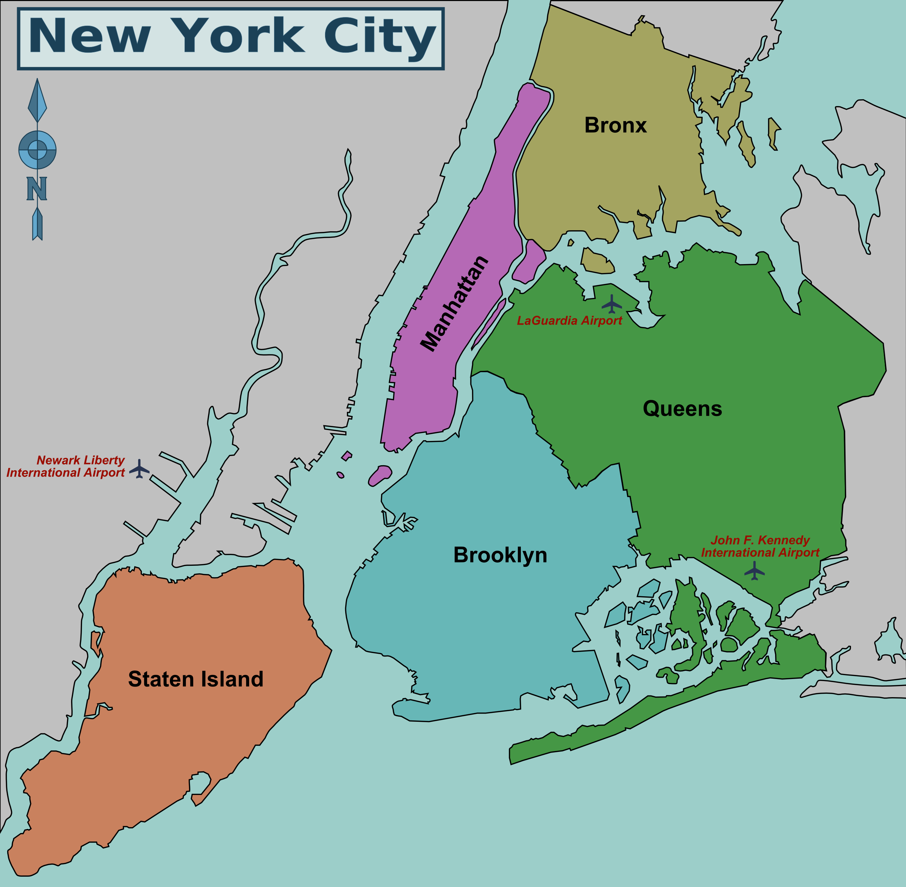

```{r setup, include=FALSE}
library(flexdashboard)
library(tidyverse)
library(ggplot2)
library(plotly)
library(dplyr)
library(DBI)
library(knitr)
library(readxl)
library(DT)
library(png)
library(plotrix)
library(eeptools)
library(forcats)
library(lubridate)
library(emojifont)
#load needed libraries

NYPD_table <- read_csv("NYPD-Shooting-Incident.csv")
NYPD_table <- NYPD_table %>% select(INCIDENT_KEY,OCCUR_DATE, OCCUR_TIME, BORO, STATISTICAL_MURDER_FLAG, PERP_AGE_GROUP,PERP_SEX, PERP_RACE, VIC_AGE_GROUP, VIC_SEX, VIC_RACE)

NYPD_table$PERP_SEX <- as.factor(NYPD_table$PERP_SEX)
NYPD_table$VIC_SEX <- as.factor(NYPD_table$VIC_SEX)
NYPD_table$PERP_RACE <- as.factor(NYPD_table$PERP_RACE)
NYPD_table$VIC_RACE <- as.factor(NYPD_table$VIC_RACE)
NYPD_table$BORO <- as.factor(NYPD_table$BORO)
NYPD_table$STATISTICAL_MURDER_FLAG <- as.factor(NYPD_table$STATISTICAL_MURDER_FLAG)
NYPD_table$PERP_AGE_GROUP <- as.factor(NYPD_table$PERP_AGE_GROUP)
NYPD_table$VIC_AGE_GROUP <- as.factor(NYPD_table$VIC_AGE_GROUP)
NYPD_table$OCCUR_DATE <- as.Date(NYPD_table$OCCUR_DATE, format =  "%m/%d/%Y")


NYCMap <- 

```


Home page 
================================================================================================
Column {.sidebar data-width=450}
------------------------------------------------------------------------------------------------

Welcome to, <br> 
<b>New York Police Department Shooting Incidents Dashboard! </b> <br>
by Andrzej Krasnodebski

<br> 

Here you can see the information about Shooting Incidents that happened in New York City in years 2006 - 2020.

<br> 

The Dashboard is divided into 3 sections:

- <b>Home Page</b> (General introduction with NYC districts map for easy navigation)
- <b>Districts info</b> (Information about shooting incidents for each district)
- <b>Victims & Perpetrators</b> (Information about victims and perpetrators of shooting incidents)

<br> 
Data Source: Data.gov (URL in top right corner)
<br> 

New York City (NYC), often simply called New York, is the most populous city in the United States. With an estimated 2019 population of 8,336,817 distributed over about 302.6 square miles (784 km2), New York City is also the most densely populated major city in the United States. Located at the southern tip of the State of New York, the city is the center of the New York metropolitan area, the largest metropolitan area in the world by urban area. With almost 20 million people in its metropolitan statistical area and approximately 23 million in its combined statistical area, it is one of the world's most populous megacities. New York City has been described as the cultural, financial, and media capital of the world, significantly influencing commerce, entertainment, research, technology, education, politics, tourism, art, fashion, and sports, and is the most photographed city in the world. Home to the headquarters of the United Nations, New York is an important center for international diplomacy, and has sometimes been called the capital of the world. 
(source: Wikipedia)


Row {data-height=150}
------------------------------------------------------------------------------------------------
### Total Number of Incidents 

```{r}

valueBox(nrow(NYPD_table), icon = "fas fa-crosshairs",
         color="#A5C4D4")

```


### Average Number of Incidents per Year

```{r}
IncidentsPerYear <- NYPD_table %>% select(OCCUR_DATE) %>% group_by(year(OCCUR_DATE)) %>% count() 

valueBox(round(mean(IncidentsPerYear$n),0), icon = "fas fa-calendar-alt",
         color="#A5C4D4")

```


### Average Time of Incidents

```{r}

valueBox(format(mean(strptime(NYPD_table$OCCUR_TIME, "%H:%M:%S")), "%H:%M:%S"), icon = "fas fa-clock",
         color="#A5C4D4")

```


Row {data-height=850}
------------------------------------------------------------------------------------------------
### New York City District Map

```{r}
NYCMap
```


Districts info {data-orientation=rows}
================================================================================================


Row {data-height=200}
------------------------------------------------------------------------------------------------
### The Safest District of 2020

```{r}

valueBox(NYPD_table %>% filter(year(OCCUR_DATE)==2020) %>% select(BORO) %>% group_by(BORO) %>% count() %>% arrange(n) %>% head(1) %>% select(BORO), icon ="fas fa-user-shield",
         color="#A5C4D4")

```

### The Most Dangerous District of 2020

```{r}

valueBox(NYPD_table %>% filter(year(OCCUR_DATE)==2020) %>% select(BORO) %>% group_by(BORO) %>% count() %>% arrange(desc(n)) %>% head(1) %>% select(BORO), icon = "fas fa-exclamation-triangle",
         color="#A5C4D4")

```

### Nr of Incidents (Most Dangerous District, 2020)

```{r}
NrOFIncidentsMostDang <- NYPD_table %>% filter(year(OCCUR_DATE)==2020) %>% select(BORO) %>% group_by(BORO) %>% count() %>% arrange(desc(n)) %>% head(1) %>% select(n)

valueBox(NrOFIncidentsMostDang$n, icon = "fas fa-crosshairs",
         color="#A5C4D4")

```


Row {data-height=800}
------------------------------------------------------------------------------------------------

### Number of Total Incidents per District
```{r}
IncidentsPerDistrict <- NYPD_table %>% select(BORO) %>% group_by(BORO) %>% count() %>% arrange(desc(n)) 

black.bold.italic.text <- element_text(face = "bold.italic", color = "#114769")

ggplot(IncidentsPerDistrict, aes(fct_reorder(BORO,n), n)) + geom_col(color = "#114769", fill = "#A5C4D4",width = 0.6) + labs(x="District", y="Total Number of Incidents") + theme(title = black.bold.italic.text, axis.title = black.bold.italic.text) + geom_text(aes(label = n), position = position_stack(vjust = 0.5)) +
theme(axis.text.x = element_text(angle = 30, hjust = 1)) + theme_classic() + coord_flip()
```


### Number of Murders per District in 2020
```{r}
MurdersPerDistrict <- NYPD_table %>% filter(STATISTICAL_MURDER_FLAG==TRUE, year(OCCUR_DATE)==2020) %>% select(BORO) %>% group_by(BORO) %>% count() %>% arrange(desc(n)) 


ggplot(MurdersPerDistrict, aes(fct_reorder(BORO,n), n)) + geom_col(color = "#114769", fill = "#A5C4D4",width = 0.6) + labs(x="District", y="Number of Murders in 2020") + theme(title = black.bold.italic.text, axis.title = black.bold.italic.text) + geom_text(aes(label = n), position = position_stack(vjust = 0.5)) +
theme(axis.text.x = element_text(angle = 30, hjust = 1)) + theme_classic()
```


Victims & Perpetrators {data-orientation=rows}
================================================================================================

Row {data-height=200}
------------------------------------------------------------------------------------------------
### Average Victim Age


```{r}

valueBox(NYPD_table %>% select(VIC_AGE_GROUP) %>% group_by(VIC_AGE_GROUP) %>% count() %>% arrange(desc(n)) %>% head(1) %>% select(VIC_AGE_GROUP), icon ="fas fa-male",
         color="#A5C4D4")

```

### Most Victim Sex

```{r}

valueBox(NYPD_table %>% select(VIC_SEX) %>% group_by(VIC_SEX) %>% count() %>% arrange(desc(n)) %>% head(1) %>% select(VIC_SEX), icon = "fas fa-male",
         color="#A5C4D4")

```

### Average Perparator Age

```{r}

valueBox(NYPD_table  %>% select(PERP_AGE_GROUP) %>% na.omit() %>% group_by(PERP_AGE_GROUP) %>% count() %>% arrange(desc(n)) %>% head(1) %>% select(PERP_AGE_GROUP), icon ="fas fa-user-ninja",
         color="#A5C4D4")

```

### Most Perparator Sex

```{r}

valueBox(NYPD_table %>% select(PERP_SEX) %>% group_by(PERP_SEX) %>% count() %>% arrange(desc(n)) %>% head(1) %>% select(PERP_SEX), icon = "fas fa-user-ninja",
         color="#A5C4D4")

```

Row {data-height=800}
------------------------------------------------------------------------------------------------


### Victim's Sex and Race per District (2020)
```{r}
ggplot (NYPD_table %>% filter(year(OCCUR_DATE)==2020)%>% select(BORO, VIC_SEX, VIC_RACE)%>% filter(VIC_SEX!="U", VIC_RACE!="UNKNOWN") %>% mutate(VIC_RACE=fct_collapse(VIC_RACE, BLACK=c("BLACK", "BLACK HISPANIC"), WHITE=c("WHITE", "WHITE HISPANIC"))), aes(VIC_SEX, fill=VIC_RACE)) + 
  geom_bar(position = "dodge") + 
  facet_wrap(~BORO) + 
  labs(x="Victim's Sex", y="Number of Incidents (log10)", fill = "Victim's Race") + 
  theme(title = black.bold.italic.text, axis.title = black.bold.italic.text) + 
  theme_linedraw() + scale_y_log10() + 
scale_fill_manual("Victim's Race", values = c("ASIAN / PACIFIC ISLANDER" = "gray", "BLACK" = "#114769", "WHITE" = "#A5C4D4"))
```


### Number of Killed by Race per District (2020)
```{r}
ggplot(NYPD_table %>% filter(year(OCCUR_DATE)==2020, STATISTICAL_MURDER_FLAG==TRUE)%>% select(BORO, VIC_RACE)%>% filter(VIC_RACE!="UNKNOWN") %>% mutate(VIC_RACE=fct_collapse(VIC_RACE, BLACK=c("BLACK", "BLACK HISPANIC"), WHITE=c("WHITE", "WHITE HISPANIC"))), aes(BORO, fill=VIC_RACE)) + 
geom_bar(position = "dodge")  + 
labs(x="District", y="Number of Killed", fill = "Victim's Race") + 
theme(title = black.bold.italic.text, axis.title = black.bold.italic.text) +
theme(axis.text.x = element_text(angle = 30, hjust = 1)) + 
theme_linedraw() + 
scale_fill_manual("VIC_RACE", values = c("ASIAN / PACIFIC ISLANDER" = "gray", "BLACK" = "#114769", "WHITE" = "#A5C4D4"))+
theme(axis.text.x = element_text(angle = 30, hjust = 1))


```


